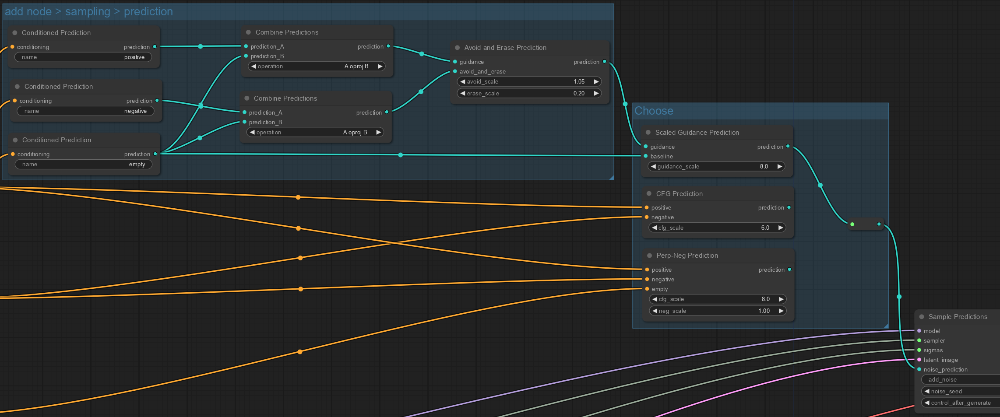

# ComfyUI-Prediction
Fully customizable Classifer Free Guidance for [ComfyUI](https://github.com/comfyanonymous/ComfyUI).

Copyright 2024 by @RedHotTensors and released by [Project RedRocket](https://huggingface.co/RedRocket).

# Installation
Copy ``custom_nodes/nodes_pred.py`` into ``ComfyUI/custom_nodes``.

(Optional) If you want beautiful teal PREDICTION edges like the example apply ``patches/colorPalette.js.patch`` to ``ComfyUI/web/extensions/core/colorPalette.js``.

# Usage
All custom nodes are provided under <ins>Add Node > sampling > prediction</ins>. An example workflow is in ``examples/custom_prediction.json``.

Follow these steps for fully custom prediction:
1. You will need to use the <ins>sampling > prediction > Sample Predictions</ins> node as your sampler.
2. The *sampler* input comes from <ins>sampling > custom_sampling > samplers</ins>. Generally you'll use **KSamplerSelect**.
3. The *sigmas* input comes from <ins>sampling > custom_sampling > schedulers</ins>. If you don't know what sigmas you are using, try **BasicScheduler**. (NOTE: These nodes are **not** in the "sigmas" menu.)
4. You'll need one or more prompts. Chain <ins>conditioning > CLIP Text Encode (Prompt)</ins> to <ins>sampling > prediction > Conditioned Prediction</ins> to get started.
5. After your prediction chain, connect the result to the *noise_prediction* input of your **Sample Predictions** node.

# Predictors

## Primitive Nodes
All other predictions can be implemeted in terms of these two nodes. However, it may get a little messy.

**Combine Predictions** - Operates on two predictions. Supports add (+), sutract (-), multiply (*), divide (/), vector projection (proj), vector rejection (oproj), average (avg), min, and max. 
``prediction_A <operation> prediction_B``

**Scale Prediction** - Linearly scales a prediction. 
``prediction * scale``

## Convinence Nodes
**Scaled Guidance Prediction** - Combines a baseline prediction with a scaled guidance prediction, similar to CFG. 
``baseline + guidance * scale``

**Avoid and Erase Prediction** - Re-aligns a desirable (positive) prediction called *guidance* away from an undesirable (negative) prediction called *avoid_and_erase*, and erases some of the negative prediction as well. 
``guidance - (guidance proj avoid_and_erase) * avoid_scale - avoid_and_erase * erase_scale``

## Prebuilt Nodes
**CFG Prection** - Vanilla Classifer Free Guidance (CFG) with a postive prompt and a negative/empty prompt. 
``(positive - negative) * cfg_scale + negative``

**Perp-Neg Prediction** - Implements https://arxiv.org/abs/2304.04968. This is also implmeneted less flexibly in vanially ComfyUI under <ins>_for_testing > Perp-Neg</ins>. 
``pos_ind = positive - empty; neg_ind = negative - empty`` 
``(pos_ind - (pos_ind proj neg_ind) * neg_scale) * cfg_scale + empty``

# Limitations
ControlNet is not supported at this time.

Regional prompting may work but is totally untested.

Any other advanced features affecting conditioning are not likely to work.

# License
The license is the same as ComfyUI, GPL 3.0.
